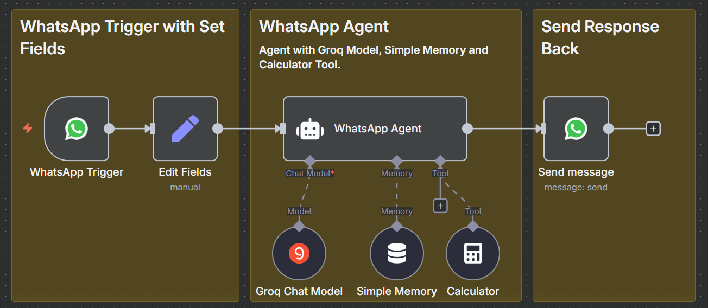

# 🤖 n8n WhatsApp Agent

An AI-powered WhatsApp automation built with **n8n**, combining conversational intelligence with real-time responses.  
## 🖼 Workflow Overview

## ✨ Features

- **WhatsApp Integration**  
  - Triggers on incoming WhatsApp messages.  
  - Sends automated responses directly back to the user.  

- **AI-Powered Agent**  
  - Uses **Groq Chat Model** for generating smart, concise, and friendly responses.  
  - Handles free-form conversations in real time.  

- **Conversation Memory**  
  - Maintains short-term memory of the chat session for contextual replies.  
  - Session-based memory ensures continuity across user interactions.  

- **Dynamic Tools**  
  - **Calculator Tool** for solving math queries instantly.  
  - Flexible agent architecture to extend with more tools if needed.  

- **Message Preprocessing**  
  - Extracts and cleans incoming text before passing it to the AI model.  
  - Ensures smooth and consistent input handling.  

- **Seamless Workflow**  
  - Incoming message → Field Editing → AI Agent (Groq + Memory + Tools) → Outgoing Response.  

## 📌 Use Cases

- Personal WhatsApp AI assistant.  
- Customer support automation.  
- Smart FAQ bot for businesses.  
- Context-aware conversational workflows.  
